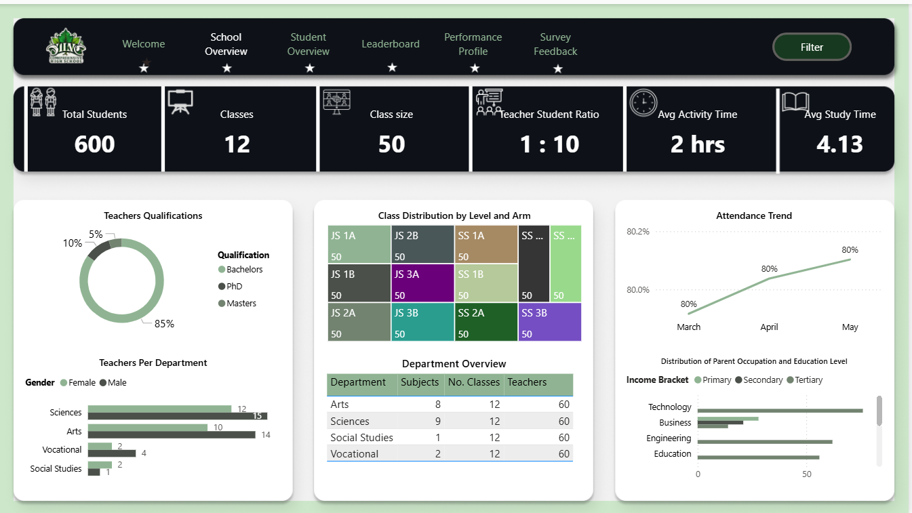

# Kuku Faruq Olabiyi - Data Analyst Portfolio

Welcome! This repository contains the complete template and source code for my **professional, one-page data analytics portfolio**, hosted for free on **GitHub Pages**.

---

## 📊 About This Portfolio
This portfolio showcases my work at the intersection of **data analytics** and **energy market intelligence**.  
It highlights how I apply analytical methods to turn complex datasets into **clear, actionable insights** that support decision-making in the **renewable energy and power markets**.

My focus areas include:

- Data visualization and storytelling for executive dashboards  
- Energy market forecasting and scenario modeling  
- Data modeling and transformation (Power Query, DAX, SQL)  
- Translating data into strategy and alignment across teams  

> 💬 *“Everyone talks about moving fast, but speed means nothing without alignment.  
> And you can’t align on gut feeling — you need data.”*

---

## 🚀 Projects

This portfolio highlights a selection of my most relevant work.  
Each project includes links to live dashboards or GitHub repositories and preview images stored in the `assets/images` folder.

### 🌍 [EU Power Market Forecast Dashboard](https://github.com/iexcelwithdata/EU-Power-Market-Forecast-)
An interactive Power BI dashboard visualizing renewable energy **capture price forecasts** across Great Britain and Germany.  
- **Tools:** Power BI, DAX, Power Query, Excel  
- **Focus:** Inflation-adjusted forecasts for Solar PV, Onshore & Offshore Wind  
- **Impact:** Supports long-term planning and scenario analysis for investors.  

  

---

### 🧠 [Datathon Energy Analytics Project](https://github.com/iexcelwithdata/Datathon)
Developed a complete analytical solution during a renewable-energy data challenge.  
- **Tools:** Python, Power BI, Excel  
- **Focus:** Data cleaning, trend analysis, and time-series forecasting  
- **Outcome:** Created a predictive framework to evaluate generation and price behavior.  

  

---

### 🎵 [Chinook Music Store Dashboard](https://github.com/iexcelwithdata/Chinook-Music-Store)
A Power BI business intelligence dashboard analyzing music store performance metrics.  
- **Tools:** Power BI, SQL  
- **Focus:** Revenue distribution, customer segmentation, and performance KPIs  
- **Outcome:** Showcases analytical storytelling and visualization design.  

  

---
### 📡 [Telecommunications Infrastructure & Broadband Equity Analysis — Connecticut](https://github.com/iexcelwithdata/Connecticut-Telecom-Analysis)
*A Power BI & DAX-driven exploration of broadband accessibility and telecom tower distribution in Connecticut.*

- **Status:** 🚧 *In Progress*  
- **Tools:** Power BI, DAX, Power Query (M), SQL, Excel  
- **Focus:** Broadband equity, tower density, provider overlap, infrastructure planning  
- **Impact Goal:** Identify underserved towns and quantify the “tower gap” affecting statewide connectivity.  
- **Next Step:** Integrate forecast models for tower capacity and regional coverage efficiency.

  

> 📈 *A data-driven view of broadband inequality — helping policymakers and telecom providers plan smarter infrastructure expansion.*

---

## 🛠️ Skills

| Category | Tools & Technologies |
|-----------|----------------------|
| **Data Visualization** | Power BI, Excel, Power Query |
| **Data Modeling** | DAX, SQL, Star Schema Design |
| **Forecasting & Analysis** | Python (pandas, matplotlib), Time-Series Forecasting |
| **Business Intelligence** | Power BI Service, Power Automate |
| **Version Control** | Git, GitHub |

---

## 🌐 Connect with Me

  
  &nbsp;
  
  &nbsp;
  

---

  <em>“Data is not just numbers — it’s alignment, clarity, and confidence.”</em>

